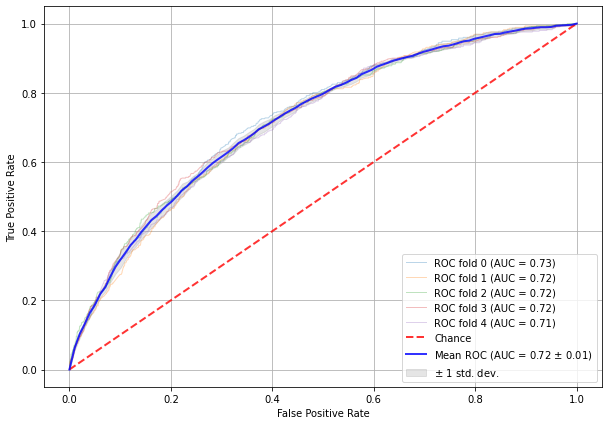
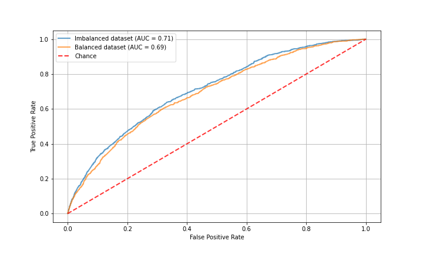
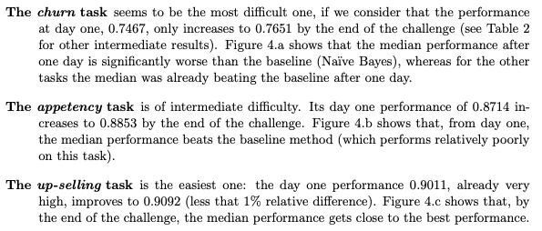
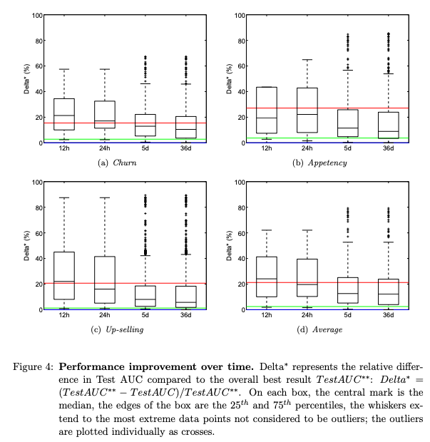

# Customer-Churn-Prediction
The aim of this project was to predict whether a certain customer would churn given a set of
features about a customer. The data I used was taken from the [KDD Cup 2009](https://www.kdd.org/kdd-cup/view/kdd-cup-2009)
. This is a real dataset from the French Telecom company Orange. Unlike the majority of datasets
 from sites such as Kaggle this dataset posed a real challenge due to the sparsity of it's
  features as well as the number of features (230).

Following the metric of the competition itself, **my aim was to produce a model that obtained the
 highest area under the ROC curve**.
 
I chose to use the small dataset instead of the large one. The difference is not in the number of
 observations they provide but in the number of features. As mentioned above, the small dataset
  had 230 features where as the large contained over 14,000!
 
## Results
My final results on a held-out test set of around 15,000 observations was an AUC 0f 0.71.
My final model consisted of an adaboosted ensemble of 40 decision trees using a maximum
depth of 1 for each tree with a learning rate of 0.5 and entropy as the selected criterion for
evaluating splitting candidates. Below is the ROC curve for this model evaluated on the training
 set using cross-validation with 5 folds
 

The AUC for the CV training set is 0.72 and could be as high as 0.73 within the error bars
 estimated from CV. Here is the plot for this model evaluated on a held-out test set for a model
  training on a balanced and unbalanced training set.

### Comments

1. Interestingly, the model performed better on the test set when trained on the imbalanced dataset
. 

    I think this is because the whole point of adaboosting is that subsequent learners try to
predict the mistakes of earlier ones. Thus if you give it loads of (duplicate) examples of the
 minority
class and the first few learners get these wrong, they will be weighted more heavily for later
learners. Thus the later learners will become very good at predicting the minority class
possibly at the detriment of the majority class.

2. The best AUC in the actual competition was 0.7651 and the in-house classifier used by Orange
 achieves a AUC of 0.7435.
 
    The in-house classifier takes 3 hours to train. This is for all three tasks of predicting
    churn, appetency, and up-selling so an average of 1 hour per task. My model could be retrained in about 30 seconds because of my use of the smaller dataset with far less features. However, as detailed in the [report](http://www.vincentlemaire-labs.fr/publis/jmlrwcp_2009_camera_ready.pdf) following the
    competition, the majority of teams did better on the larger training set. So performing at
    95 % (0.71/0.7435) and 93% (0.71/0.7651) of the Orange and compeition winner's models by
     using the smaller dataset seems pretty good. It would be a business decision as to whether to increase in AUC from using a model that takes an hour to train is worth it compared to a model that could be retrained in seconds. For Orange I imagine it does matter since they probably lose a lot of money from customers leaving and they presumely have the resources to retrain models for an hour (not to mention the people to tweak these models).
     
 3. I did not revisit data cleaning.
    
    This task was particularly difficult due to the amount of missing entries in the dataset
    . Furthermore, because the data had been blinded, making logical decisions about encoding
     and imputing variables was made very difficult. This lead to a lot of ad-hoc solutions to
      either filling in data, grouping values, or dropping it altogether. Since your model is
       only as good as the
    data you feed it, I am sure that taking a different approach to the data cleaning and
    imputing process would yield slightly better results. However, as the report points out
    , most people did better on the larger training set so although I could chase that extra
    0.02 of AUC I don't think it would be time particularly well spent. But it is something
      to note. If done again, I think the data cleaning and feature engineering is where there is
       the most room for improvement.
      
4. Churn was by far the hardest task in the competition.

    The report's figures show that predicting churn was by far the hardest task of the three.
    See the images below taken from the report.
    
    
    
    
    

## Key takeaways

1. Data wrangling took up a significant portion of my time due to the nature of the data
 Pratice data wrangling as real world data is ugly and messy
2. Features are not always distributed normally - use both logic and the data to deal with this
3. Adaboost can make even terrible decisions trees great
    
    A single decision tree only achieved a AUC of 0.53, where as the base logistic regression
     model achieved 0.68. But using an adaboosted decision tree improved the AUC to 0.72.
4. You can tweak models until the cows come home

    As stated in the [write up](http://www.vincentlemaire-labs.fr/publis/jmlrwcp_2009_camera_ready.pdf) very little improvement was seen from submissions within the
    first few hours and those who submitted after a month. Depending on the business problem at
    hand, a decision needs to be made as to whether all the extra time is worth the extra 0.03
    units of AUC.

## What I learned

1. I learned a lot of data imputation techniques

    Because of the amount of missing values and the frequency of non-normally distributed
     fteaures I had to take a bit of a deep dive into imputation and feature engineerin
      techniques. 
      
      For the columns that were normally distributed I used a simple mean imputation
      , and for the ones that showed some skew I used median.
        
    I also used a NN to impute values for one column which exhibited over 20,000 missing values
    . This was interesting and something I had never thought of doing before. Its difficult to
    say if it worked or not, but it definitely wasn't terrible since I still managed to achieve
    a AUC of 0.71.
    
    Finally I used a simple linear regression to fill in missing data for a few columns. To do
    this I looked at a correlation plot and found features that were highly correlated. Then
    to fill in the missing data of a feature, I regressed its values onto the features it was
     highly correlated with. To see if the regression was successful I used the r squared
      value. If this was high I then  predicted the missing values using this linear
      regression model. 
      
2. I learned some simple dimensionality reduction techniques for categorical features

    For categorical variables that showed a huge number of values, one-hot-encoding them seemed
   like a dangerous scheme as I thought I could easily get lost in the curse of
    dimensionality when it came to fitting models to the data. Because of this I learned
    about grouping of variables into new values. For example, a lot of the categorical
    features that had more than 100 values I split into 2 new values, with say the top 10
    % most frequently occuring values as one group and the rest in another. Thus reducing
    the one-hot-encoding from 100 variables to 1.
      
3. I learned that there are 3 classes of feature selection

    Filter methods do not rely on a model in order to select features. Examples of this are
     variable ranking, such as selecting the top 50% of features as ranked by their Pearson's
      correlation value.
      
      Wrapper methods use the model being trained to decide whether to include a feature or not
      . They create many models with different subsets of input features and select those features that result in the best performing model according to a performance metricExamples of this are forward and backward selection. I ended up using recursive feature
       elimination which is also an example of this but I didn't get any performance using this
        method.
        
       Embedded methods, very similar to wrapper methods, but the feature selection is implicitly
        performed by the model as the training progresses without creating many models as in
         wrapper methods
        . Examples of this are lasso and ridge
         regression.
         
 4. I read into classification metrics a lot
 
    Interestingly the organisers of this competition decided to go with AUC as their evaluation
    metric. However, for cases of imbalanced classes the advice from reading around seems to be
    that the AUC of the precision recall graph is a much more informative metric to use. The ROC
    curve is insensitive to changes in the ratio of the classes where as the precision recall
    curve is not. So to me it seems like this precision-recall curve is a better metric too but
    I wanted to be able to make direct comparisons with the competition submissions so I went
    with AUC of ROC. But in future it is worth nothing that in cases of imbalanced data that
    AUC of precision-recall is preferred.
    
5. I experienced the 80/20 rule first hand

    It was quite easy to achieve an AUC of 0.68 with just a simple logistic regression model
    . However, going from that to 0.72 took a lot of my time when modelling (actually more than
     80% of my time). 
